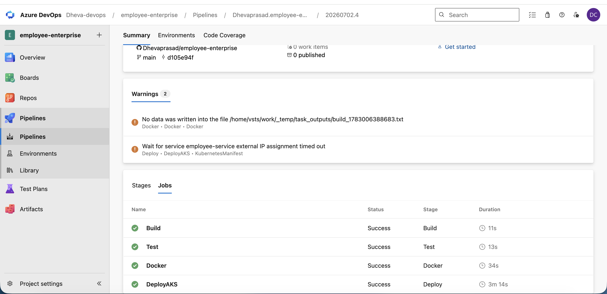
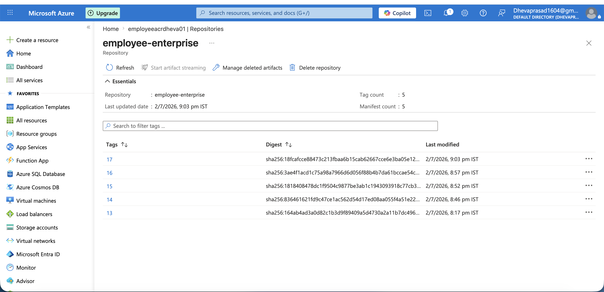
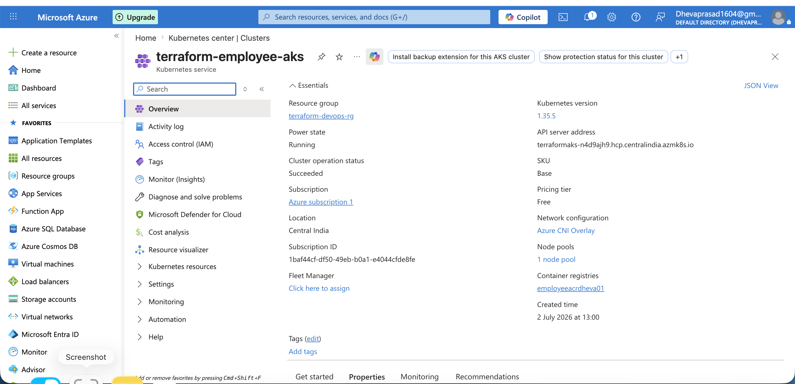
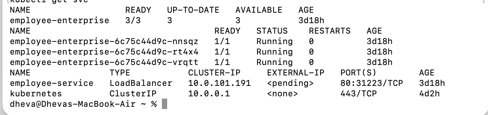

# End-to-End CI/CD Pipeline on Azure using Terraform, Docker, AKS & Azure DevOps

## Overview

This project demonstrates a complete end-to-end CI/CD pipeline for deploying a containerized Flask application to Azure Kubernetes Service (AKS) using Azure DevOps and Terraform.

The project automates:

- Azure infrastructure provisioning using Terraform
- Docker image build and push to Azure Container Registry (ACR)
- Continuous Integration (Build & Test)
- Continuous Deployment to AKS
- Kubernetes Deployment and Service creation

---

## Architecture

```
                GitHub Repository
                        │
                        ▼
              Azure DevOps Pipeline
        ┌──────────────┴──────────────┐
        │                             │
     Build & Test               Docker Build
        │                             │
        └──────────────┬──────────────┘
                       ▼
        Azure Container Registry (ACR)
                       │
                       ▼
      Azure Kubernetes Service (AKS)
                       │
          Deployment + Service
                       │
                       ▼
              Containerized Flask App
```

---

## Technologies Used

- Azure DevOps
- Terraform
- Docker
- Kubernetes
- Azure Kubernetes Service (AKS)
- Azure Container Registry (ACR)
- Python Flask
- PyTest
- Git & GitHub

---

## Project Structure

```
employee-enterprise
│
├── app
│   ├── app.py
│   ├── Dockerfile
│   ├── requirements.txt
│   └── test_app.py
│
├── terraform
│   ├── provider.tf
│   ├── variables.tf
│   ├── terraform.tfvars
│   ├── main.tf
│   └── outputs.tf
│
├── k8s
│   ├── deployment.yaml
│   └── service.yaml
│
├── azure-pipelines.yml
└── README.md
```

---

## Terraform

Terraform provisions the following Azure resources:

- Resource Group
- Azure Container Registry (ACR)
- Azure Kubernetes Service (AKS)
- IAM Role Assignment (AcrPull)

The `AcrPull` role assignment allows the AKS managed identity to securely pull container images from Azure Container Registry.

---

## Azure DevOps Pipeline

The pipeline consists of four stages:

### Build
- Install Python dependencies

### Test
- Execute unit tests using PyTest

### Docker
- Build Docker image
- Push image to Azure Container Registry

### Deploy
- Deploy application to Azure Kubernetes Service using Kubernetes manifests

---

## Kubernetes

### Deployment

Responsible for:

- Creating Pods
- Managing ReplicaSets
- Maintaining desired replica count

### Service

Responsible for:

- Exposing the application
- Creating an external LoadBalancer
- Providing an external IP to access the application

---

## CI/CD Workflow

```
Developer
     │
     ▼
GitHub Repository
     │
     ▼
Azure DevOps Pipeline
     │
     ├── Build
     ├── Test
     ├── Docker Build & Push
     └── Deploy
            │
            ▼
Azure Container Registry
            │
            ▼
Azure Kubernetes Service
            │
            ▼
Deployment
            │
            ▼
Pods
            │
            ▼
LoadBalancer Service
            │
            ▼
Application
```

---

## Features

- Infrastructure as Code using Terraform
- Automated Azure resource provisioning
- Docker containerization
- Automated Docker image publishing
- Multi-stage Azure DevOps CI/CD pipeline
- Kubernetes deployment automation
- Automated AKS to ACR authentication using Terraform-managed AcrPull role assignment
- Unit testing with PyTest

---

## Skills Demonstrated

- Azure DevOps
- Terraform
- Docker
- Kubernetes
- AKS
- Azure Container Registry
- CI/CD
- Infrastructure as Code (IaC)
- Git
- Python Flask

---

## Future Improvements

- Helm Charts
- Ingress Controller
- Horizontal Pod Autoscaler (HPA)
- Terraform Remote State
- Monitoring with Prometheus & Grafana
- Azure Key Vault integration

---

## 📸 Screenshots

### Azure DevOps Pipeline

Shows the successful execution of the Build, Test, Docker and Deploy stages.



---

### Azure Container Registry (ACR)

Docker images automatically pushed to Azure Container Registry through the CI/CD pipeline.



---

### Azure Kubernetes Service (AKS)

Terraform-provisioned AKS cluster connected with Azure Container Registry.



---

### Kubernetes Deployment Verification

Verifying the deployment using kubectl.

- Deployment: 3/3 replicas available

- Pods: Running

- Service: LoadBalancer



## Author

**Dhevaprasad R C**

GitHub: https://github.com/Dhevaprasad
